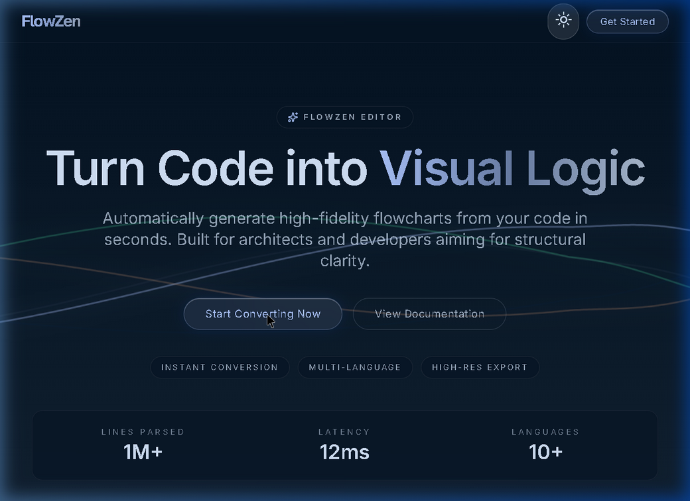
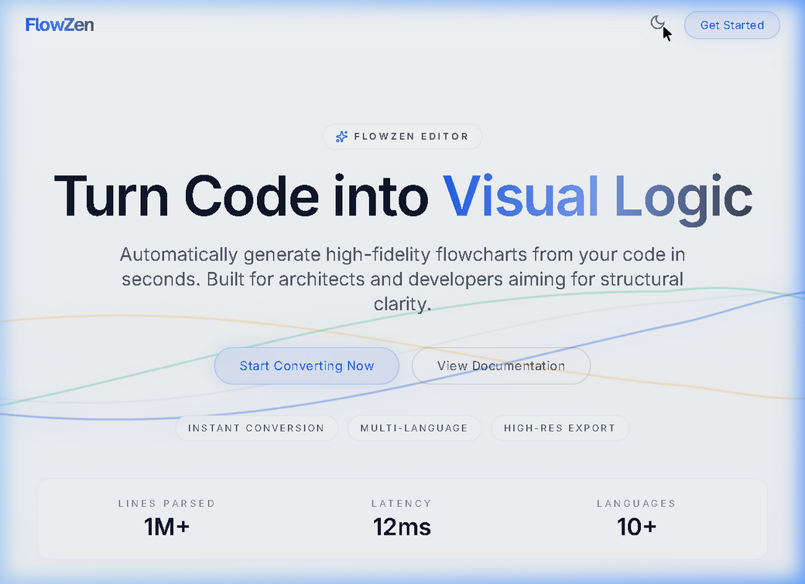
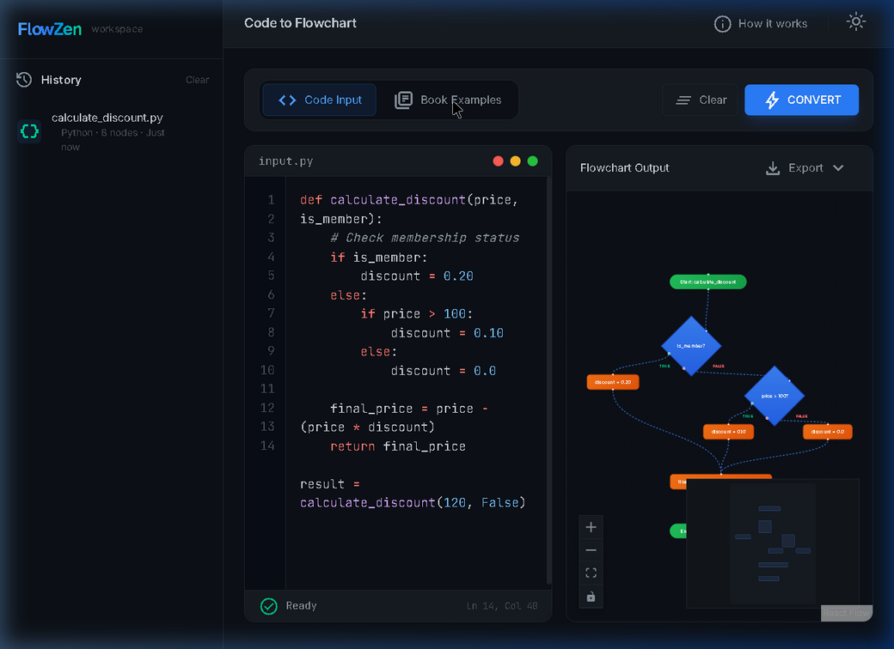
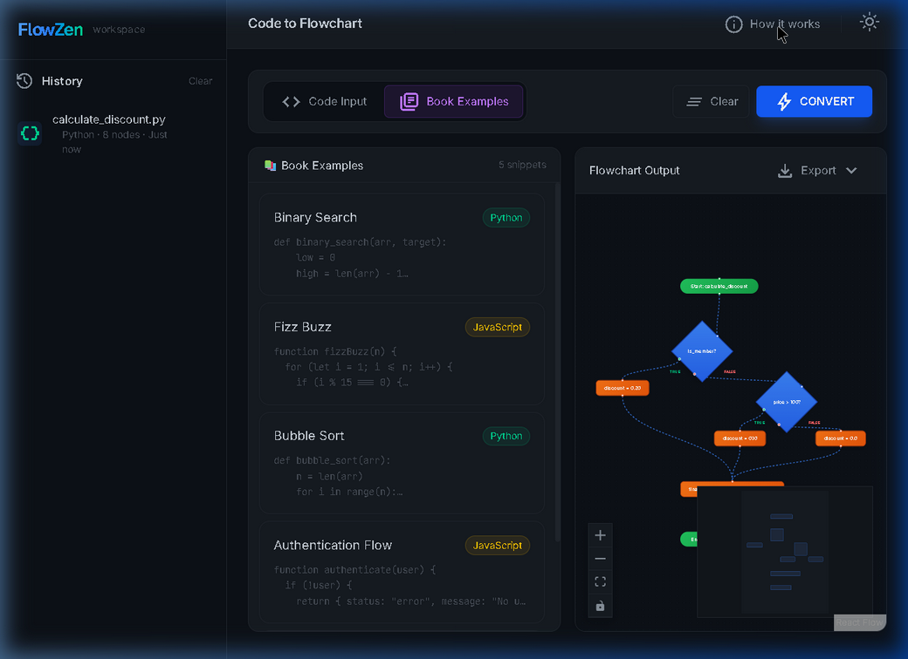
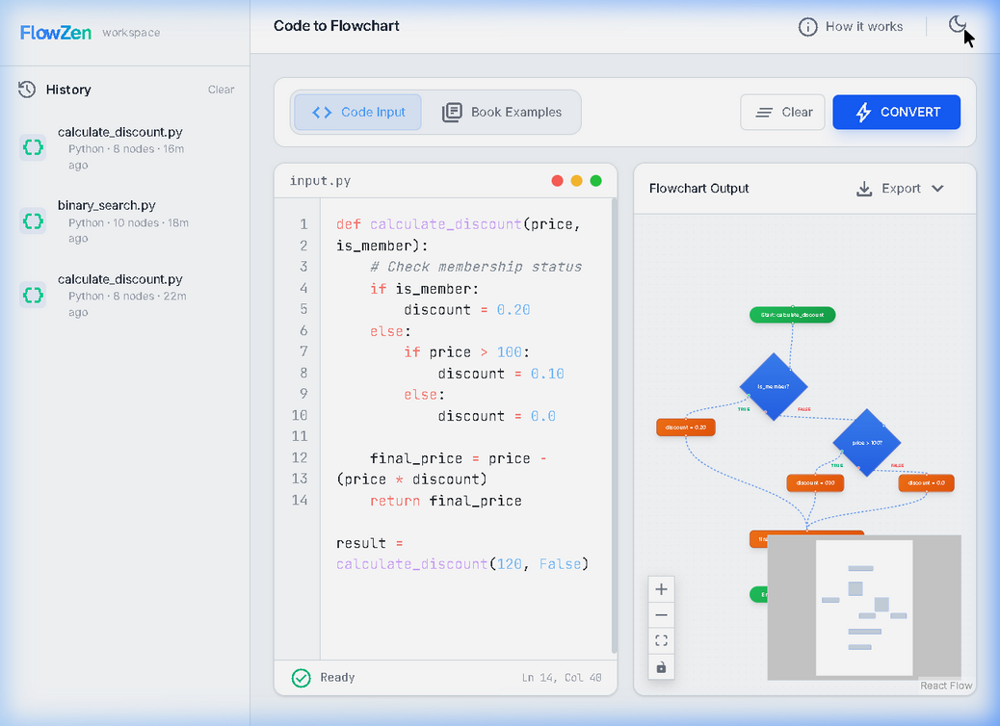

<p align="center">
  
</p>

<h1 align="center">FlowZen</h1>

<p align="center">
  <strong>Turn Code into Visual Logic — Instantly</strong>
</p>

<p align="center">
  
  
  
  
  
  
</p>

<p align="center">
  <a href="#-features">Features</a> •
  <a href="#-screenshots">Screenshots</a> •
  <a href="#-tech-stack">Tech Stack</a> •
  <a href="#-getting-started">Getting Started</a> •
  <a href="#-project-structure">Project Structure</a> •
  <a href="#-security">Security</a> •
  <a href="#-contributing">Contributing</a>
</p>

---

## ✨ What is FlowZen?

FlowZen is an AI-powered code-to-flowchart converter that transforms your source code into beautiful, interactive flowcharts in seconds. Paste Python, JavaScript, or any code — and watch it come alive as a structured visual diagram.

> Built for developers, architects, and educators who want structural clarity from their code.

---

## 🎯 Features

| Feature | Description |
|---------|-------------|
| 🤖 **AI-Powered Conversion** | Paste any code → get an instant, validated flowchart via Google Gemini |
| 🎨 **Dual Theme** | Fully responsive light & dark mode with smooth toggling |
| 📖 **Book Examples** | 5 pre-built code snippets (Binary Search, FizzBuzz, Bubble Sort, Auth Flow, Fibonacci) |
| 📥 **Multi-Format Export** | Save flowcharts as **PNG**, **SVG**, or **PDF** |
| 📜 **Smart History** | Auto-saved conversion history with full state restoration (code + flowchart) |
| 🔍 **Interactive Canvas** | Zoom, pan, auto-fit, minimap, and controls powered by React Flow |
| 🛡️ **Security Hardened** | Input validation, rate limiting, Zod schema validation, CSP headers |
| ⚡ **Blazing Fast** | Vite 8 + React 19 for instant HMR and sub-second page loads |

---

## 📸 Screenshots

### 🌙 Dark Mode — Homepage
<p align="center">
  
</p>

### ☀️ Light Mode — Homepage
<p align="center">
  
</p>

### 🖥️ Workspace — Code Editor + Flowchart Output
<p align="center">
  
</p>

### 📖 Book Examples
<p align="center">
  
</p>

### ☀️ Workspace — Light Mode
<p align="center">
  
</p>

---

## 🏗️ Tech Stack

| Layer | Technology | Purpose |
|-------|-----------|---------|
| **Frontend** | React 19 + TypeScript 6 | UI framework with type safety |
| **Styling** | Tailwind CSS v4 | Utility-first CSS with `@theme` design tokens |
| **State** | Zustand (persisted) | Lightweight global state with localStorage sync |
| **Flow Engine** | React Flow | Interactive node-based flowchart rendering |
| **AI** | Google Gemini API | Code analysis and flowchart generation |
| **Validation** | Zod | Runtime schema validation for AI output |
| **Export** | html-to-image + jsPDF | Multi-format chart export |
| **Build** | Vite 8 | Lightning-fast dev server and bundler |

---

## 🚀 Getting Started

### Prerequisites

- **Node.js** 18+ 
- **npm** 9+
- A [Google Gemini API Key](https://aistudio.google.com/apikey)

### Installation

```bash
# 1. Clone the repository
git clone https://github.com/kumarimanjusrimohantycse2024-art/FlowZen.git
cd FlowZen

# 2. Install dependencies
npm install

# 3. Configure environment
cp .env.example .env
# Open .env and paste your Gemini API key

# 4. Start development server
npm run dev
```

The app will be available at `http://localhost:5173`

### Environment Variables

| Variable | Description | Required |
|----------|-------------|----------|
| `VITE_GEMINI_API_KEY` | Google Gemini API Key | ✅ |

---

## 📁 Project Structure

```
flowzen/
├── public/
│   └── favicon.svg          # App favicon
├── src/
│   ├── api/
│   │   └── gemini.ts        # AI integration (rate-limited, Zod-validated)
│   ├── components/
│   │   ├── ui/               # Reusable UI primitives
│   │   │   ├── glass-button.tsx
│   │   │   ├── category-list.tsx
│   │   │   ├── footer-1.tsx
│   │   │   └── glowy-waves-hero-shadcnui.tsx
│   │   ├── HomePage.tsx      # Landing page
│   │   ├── Workspace.tsx     # Main workspace layout
│   │   ├── CodeEditor.tsx    # Syntax-highlighted code editor
│   │   ├── FlowCanvas.tsx    # React Flow canvas with controls
│   │   ├── FlowNodes.tsx     # Custom node renderers
│   │   └── Sidebar.tsx       # History sidebar
│   ├── lib/
│   │   └── utils.ts          # Utility functions (cn helper)
│   ├── store/
│   │   └── useStore.ts       # Zustand state (code, nodes, history, theme)
│   ├── utils/
│   │   └── export.ts         # PNG/SVG/PDF export engine
│   ├── index.css             # Global styles + CSS design tokens
│   ├── App.tsx               # Root component + routing
│   └── main.tsx              # Entry point
├── .env.example              # Environment template
├── .gitignore                # Git exclusion rules
├── index.html                # HTML entry (CSP + SEO hardened)
├── vite.config.ts            # Vite configuration
├── tsconfig.json             # TypeScript configuration
└── package.json              # Dependencies and scripts
```

---

## 🔒 Security

FlowZen has been through a comprehensive security audit. Key protections include:

| Protection | Implementation |
|-----------|----------------|
| **Input Validation** | 10,000 char limit + empty input guard |
| **Rate Limiting** | 3-second cooldown between API calls |
| **Schema Validation** | Zod validates all AI responses before rendering |
| **XSS Prevention** | Full HTML entity escaping including single quotes |
| **CSP Headers** | Content Security Policy restricting script/style/connect sources |
| **Frame Protection** | X-Frame-Options: DENY prevents clickjacking |
| **No Secret Exposure** | `.env` gitignored, `.env.example` provided |
| **Dev-Only Logging** | Zero `console.*` output in production builds |

> ⚠️ **Note:** The Gemini API key is currently used client-side via `VITE_` prefix. For production deployment, route API calls through a backend proxy to keep the key secret.

---

## 📜 Available Scripts

```bash
npm run dev       # Start development server (Vite)
npm run build     # Production build (TypeScript + Vite)
npm run lint      # Run ESLint
npm run preview   # Preview production build locally
```

---

## 🤝 Contributing

Contributions are welcome! Please feel free to submit a Pull Request.

1. Fork the repository
2. Create your feature branch (`git checkout -b feature/amazing-feature`)
3. Commit your changes (`git commit -m 'Add amazing feature'`)
4. Push to the branch (`git push origin feature/amazing-feature`)
5. Open a Pull Request

---

## 📄 License

This project is licensed under the MIT License — see the [LICENSE](LICENSE) file for details.

---

<p align="center">
  <strong>Built with ❤️ by <a href="https://github.com/mpihumohanty">M. Pihu Mohanty</a></strong>
</p>

<p align="center">
  <sub>Powered by Google Gemini AI • React Flow • Tailwind CSS</sub>
</p>
